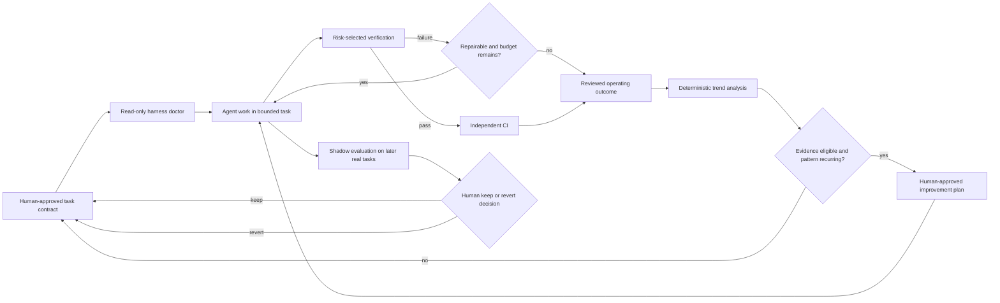

# Engineering Proposal: Controlled Frontend Loop Improvement

**Date:** 2026-08-10  
**Status:** Accepted for implementation on 2026-08-11  
**Scope:** The canonical harness CLI, outer steering loop, and task-operability gaps in `frontend-core-kit`  
**Research:** [Frontend Harness And Loop Engineering Research](2026-08-10_frontend-harness-loop-engineering-research.md)

## Recommendation

Complete the accepted frontend harness direction through two deliberately
separate control layers and one later learning capability:

1. **Canonical CLI:** make `frontendkit` the typed repository-local owner for
   harness commands and profiles while preserving pnpm compatibility aliases.
2. **Observation quality:** make task readiness, lifecycle, and verification
   failures more attributable and recoverable without changing product or
   harness policy.
3. **Controlled improvement:** after the operating ledger becomes eligible,
   evaluate one human-approved harness hypothesis against later real tasks and
   require an explicit keep/revert decision.

Do not introduce a self-modifying harness. Do not enable autonomous merge,
deployment, event-driven code changes, or blanket agent-to-agent review.

This proposal is a delta to the accepted
[Agent-First Harness And Loop Engineering Proposal](../docs/planning/agent-harness-loop-engineering-proposal.md).
It does not reopen its settled architecture, risk, authority, CI, or behavioral
oracle decisions. It refines the queued
[Phase 5 plan](../docs/exec-plans/queued/2026-08-03_agent-harness-phase-5-controlled-hill-climbing.md)
using current operating evidence and the more mature backend implementation as
a comparison.

## Context

The repository already has the inner control loop:

- a V2 plan defines objective, non-goals, acceptance, risk, allowed paths,
  allowed actions, and repair limit;
- `task:begin` captures the task boundary and pre-existing paths;
- `task:verify` raises risk, rejects scope violations, selects verification
  lanes, and stops repeated identical failures;
- full and browser verification provide deterministic and runtime feedback;
- draft handoff requires fresh verification and separate publication authority;
- clean CI independently repeats the required lanes;
- reviewed task outcomes enter a sanitized evidence ledger.

These capabilities are exposed through separate package scripts and Node entry
points. They share modules in places, but there is no single typed command
registry, canonical profile owner, structured result contract, or operator
entry point comparable to backend's `backendkit` and mobile's `mobilekit`.
Adding that boundary improves consistency without changing the underlying
architecture or requiring a general-purpose agent framework.

The ledger currently contains three independently reviewed, CI-reproduced
high-risk tasks. It reports one repair with an unknown historical failure
boundary and no false positives. It is correctly `insufficient` because it has
no second risk class.

The current system can therefore identify one observation-quality problem, but
it cannot yet support a claim that a harness change improves agent work across
task classes.

## Goals

- Make a failed or interrupted task reconstructable without reading a prior
  conversation or raw logs.
- Give agents, humans, and CI one canonical frontend harness command surface.
- Keep profile composition, failure output, and machine-readable results under
  one tested owner.
- Give existing verification failures stable, owned, actionable categories.
- Detect runtime/tooling/task-state problems before implementation starts.
- Preserve evidence privacy while binding outcomes to exact plans and source
  candidates.
- Prevent one-off anecdotes from becoming permanent harness complexity.
- Let a human approve one falsifiable improvement and later decide to keep or
  revert it from deterministic shadow evidence.
- Keep the implementation frontend-local, small, testable, and removable.

## Non-Goals

- Replacing the existing Node harness with a general agent platform.
- Removing pnpm aliases during the initial migration.
- Moving ordinary application development commands such as `dev` and `start`
  behind the harness CLI.
- Launching, scheduling, or supervising coding models from repository code.
- Automatically editing prompts, docs, tests, thresholds, risk rules, or
  graders.
- Lowering risk, reducing required lanes, or broadening task authority.
- Auto-merge, deployment, production mutation, secret access, or external user
  communication.
- Requiring a second agent, Gherkin, mutation testing, or every available sensor
  on every task.
- Extracting a shared cross-kit runtime before stable duplication exists.

## Invariants

### Humans authorize and decide

Only a human-approved execution plan may authorize a harness change. Trend
analysis may propose a candidate; it cannot create authority, edit policy, or
declare an improvement successful.

### Verification owns task readiness

An agent statement, transcript, or review summary cannot set a task to ready for
review. Only a successful, candidate-bound verification episode may do so.

### Automatic policy movement is monotonic toward safety

Automation may raise risk, add a required lane, stop a task, or request review.
It may not lower risk, remove a lane, increase repair budget, widen paths, add
publication authority, or weaken a threshold.

### Observation is not improvement

A single failure may justify better diagnostics or evidence capture. It does
not justify a new product constraint or grader. A blocking harness change needs
a recurring pattern and an evaluation contract.

### Improvement is an experiment with rollback

Every harness hypothesis must identify its evidence, target, expected metric,
minimum meaningful effect, cost budget, false-positive condition, rollback
boundary, and later shadow tasks before implementation begins.

### Durable evidence remains minimal

Versioned ledgers may contain identifiers, hashes, categories, counts,
durations, and review/CI booleans. They must not contain prompts, hidden
reasoning, raw logs, source diffs, review prose, credentials, environment
values, cookies, request/response bodies, PII, or PR URLs.

## Proposed Control Flow

All repository-controlled actions in this flow enter through `frontendkit`;
native tools remain visible as the diagnostic owners underneath it.



The outer loop never returns directly into an editable grader. It returns to a
human decision and a new bounded task contract.

## Proposed Design

### 1. Canonical `frontendkit` CLI

Create a repository-local Node CLI under `tools/frontendkit/`. Its entry point
owns command parsing and dispatch; cohesive modules own policy and behavior.
Existing logic under `scripts/harness/`, `scripts/contracts/`, and
`scripts/testing/` should be imported or migrated incrementally, not copied.

The canonical invocation should be:

```bash
pnpm frontendkit -- <command>
```

The initial command model should cover the existing and proposed harness
capabilities:

| Command                                                     | Ownership                                                                    |
| ----------------------------------------------------------- | ---------------------------------------------------------------------------- |
| `frontendkit doctor`                                        | Read-only repository, toolchain, plan, task-state, and runtime prerequisites |
| `frontendkit verify --profile fast\|full\|runtime\|ci`      | One typed verification-profile registry                                      |
| `frontendkit knowledge check`                               | Repository knowledge and plan lifecycle                                      |
| `frontendkit contracts check`                               | Generated OpenAPI contract freshness                                         |
| `frontendkit risk classify`                                 | Conservative changed-path and plan risk                                      |
| `frontendkit task begin\|status\|verify\|complete\|recover` | Task authority, lifecycle, repair, and recovery                              |
| `frontendkit handoff ...`                                   | Dry-run and separately authorized publication operations                     |
| `frontendkit evidence check\|report`                        | Sanitized operating-evidence validation and aggregation                      |
| `frontendkit improve check\|analyze\|shadow`                | Read-only controlled-improvement analysis                                    |

The CLI must:

- use one tested command parser and one safe process runner;
- return stable exit codes and structured failure identifiers;
- support concise human output and sanitized machine-readable output;
- keep policy in visible modules/configuration rather than hiding it in the
  router;
- never infer authority from command availability, credentials, or network
  access;
- contain no model SDK, autonomous loop, daemon, database, or task scheduler;
- be verified as ordinary production-quality harness code with unit, negative,
  and command-parity tests.

Existing commands such as `pnpm verify:fast`, `pnpm task:verify`, and
`pnpm harness:evidence` remain compatibility aliases, but they must delegate to
`frontendkit`. CI must call the same profile registry rather than reconstructing
profile semantics in workflow YAML. Once evidence shows aliases are no longer
needed by template consumers, their removal requires a separate compatibility
decision.

### 2. Pre-task doctor

Add one read-only diagnostic owner under `tools/frontendkit/` and expose it as
`frontendkit doctor`. Supporting probes may reuse existing harness modules. It
should report stable categories for:

- Node and pnpm version compatibility;
- Git repository and worktree identity;
- active execution-plan count and validity;
- task-state presence, lifecycle, and plan fingerprint;
- private-state ignore policy;
- browser availability when the active task requires runtime evidence;
- contract and generated-artifact prerequisites that can be checked without
  contacting an external service.

The doctor reports warnings and blockers with remediation. It does not install,
edit, archive, delete, verify, commit, push, or contact external systems.

### 3. Explicit task lifecycle and recovery

Evolve ignored task state from a baseline plus failure array into an explicit
state machine. The minimum useful states are:

```text
authorized → verifying → repairing → ready_for_review → handed_off
                       ↘ escalated
                       ↘ failed
```

Every transition records a timestamp, stable reason, plan fingerprint, and
candidate fingerprint. Terminal-state recovery may archive exact private state,
but it must refuse to erase an active or ambiguous task. Recovery is an
operability function, not a way to reset the repair budget.

This state remains ignored and local. The execution plan remains the durable
source of intent; completed plans and the reviewed operating ledger remain the
durable evidence.

### 4. Stable failure taxonomy

Introduce one typed/validated mapping between existing commands and stable stop
reasons. The initial categories should cover only current sensors:

| Family              | Examples                                                 | Default owner            |
| ------------------- | -------------------------------------------------------- | ------------------------ |
| `preflight.*`       | runtime version, Git state, browser prerequisite         | harness maintainer       |
| `knowledge.*`       | invalid plan or broken repository knowledge              | documentation/plan owner |
| `scope.*`           | out-of-bound path or stale plan fingerprint              | task owner               |
| `contract.*`        | generated OpenAPI drift or invalid fixture               | API boundary owner       |
| `architecture.*`    | forbidden dependency, raw fetch, server/client violation | architecture owner       |
| `maintainability.*` | dead export, complexity/size regression                  | code owner               |
| `behavior.*`        | unit or component test failure                           | feature owner            |
| `build.*`           | production compilation failure                           | application owner        |
| `runtime.*`         | browser behavior, accessibility, or visual failure       | feature/UX owner         |
| `integration.*`     | clean CI or approved external-system mismatch            | integration owner        |

Raw tool output remains ephemeral. The task summary stores only the stable
reason, violated invariant, remediation identifier, candidate fingerprint,
lane, duration, and repairability.

### 5. Reviewed operating outcomes

Keep human-reviewed promotion into the versioned operating ledger. Extend the
schema only where needed to make later evaluation falsifiable:

- exact candidate revision or content fingerprint;
- stable terminal/stop reason;
- first-pass and eventual outcome;
- repair count and risk-selected lanes;
- total gate duration;
- independent CI reproduction;
- independent review;
- false-positive classification.

The ledger should not be populated automatically from a local run. Local
summaries are claims until a human review and clean CI bind them to the exact
candidate.

### 6. Controlled improvement hypothesis

After operating evidence is eligible, a separate versioned improvement ledger
may contain at most one `evaluating` hypothesis. Each hypothesis must include:

| Field                                | Decision it makes explicit                                      |
| ------------------------------------ | --------------------------------------------------------------- |
| Pattern and baseline task IDs        | Which recurring real outcome justifies work                     |
| Harness target                       | Which guide, sensor, diagnostic, or controller boundary changes |
| Metric                               | Which deterministic aggregate is expected to improve            |
| Minimum effect                       | What difference is large enough to retain                       |
| Cost/false-positive budget           | What regression forces rejection                                |
| Plan path and allowed rollback paths | Where authority and reversibility live                          |
| Shadow task IDs                      | Which later real tasks evaluate the change                      |
| Status                               | `proposed`, `evaluating`, `keep`, or `revert`                   |

The first supported metrics should be conservative and attributable:

- repair-or-escalation rate for one stable stop family;
- terminal escalation rate for one stable stop family;
- time to identify the failing boundary, only when timing is measured
  consistently.

Lines of code, agent commits, token counts, and raw throughput are not quality
metrics.

### 7. Shadow evaluation and keep/revert

The analyzer compares pre-registered baseline tasks with later independently
reviewed tasks. It produces a deterministic report; it does not edit the
hypothesis status.

A human chooses:

- **keep** when the minimum effect is met, cost remains within budget, required
  lanes/risk/authority are unchanged, and no unacceptable false positive or
  escaped defect appears;
- **revert** otherwise.

Terminal entries remain in the ledger as design history. Reverting removes the
experimental harness change through the predeclared rollback boundary; it does
not erase the evidence.

## Behavioral And Review Policy

The existing behavioral-independence policy remains correct. Medium/high-risk
work needs at least one oracle not invented solely by the implementation under
test: an approved scenario, generated contract, approved fixture, existing
regression, or runtime evidence.

Agent review may be added for semantic scope, architecture, security, or visual
quality when a task warrants it. It remains advisory unless calibrated against
human decisions and promoted through a separate accepted policy change.

Robert C. Martin's acceptance-test, hardening, and QA separation supports moving
human review toward intent and outcome. It does not justify removing human
review from auth/session behavior, product meaning, accessibility judgment, or
visual changes in this template.

## Workspace Isolation Decision

Do not include linked-worktree orchestration in the first controlled-improvement
slice. The current path baseline is adequate for one supervised task and already
preserves pre-existing user paths.

Record worktree isolation as the recommended next boundary if operating evidence
shows concurrent agent work, overlapping dirty-tree edits, lost long-running
state, or a need for per-change application instances. If triggered, it should
be a separate high-risk proposal because it changes branch, process, port,
cache, cleanup, and handoff behavior.

## Event-Driven Operation Decision

Treat existing PR/push CI as the current event-driven verification loop. Do not
add repository task intake or scheduled code-changing agents until there is an
approved event source, deduplication key, single-flight policy, workspace
isolation, crash recovery, and operator ownership.

A future scheduled knowledge/entropy scan may be read-only and create a bounded
report. Opening a PR, changing a grader, or acting on a report remains a
separately authorized task.

## Cross-Kit Reuse Boundary

Use `backend-core-kit` as a reference implementation for state vocabulary,
failure attribution, doctor checks, evidence eligibility, and shadow
keep/revert semantics. Do not copy its backend-specific controller wholesale.

Initially share only a written cross-kit contract and conformance examples.
`frontendkit`, `backendkit`, and `mobilekit` should use the same operator
vocabulary where semantics match, but keep runtime implementations native to
each kit. Consider extracting a shared package only after frontend and mobile
independently stabilize the same schema and a compatibility test demonstrates
that shared maintenance is cheaper than three small implementations.

## Risks And Tradeoffs

- **Harness overgrowth:** state machines and ledgers can become a second
  product. Keep one current task, one evaluating hypothesis, bounded schemas,
  and no daemon or database.
- **CLI indirection:** a wrapper can hide native tools and make debugging
  harder. Keep commands transparent, print the owned failing boundary, and
  preserve targeted native commands for diagnosis.
- **Migration drift:** pnpm aliases and the CLI can disagree. Require aliases
  and CI to delegate to one profile registry and test exact parity.
- **Metric gaming:** a lower repair rate may mean weaker detection. Pair every
  improvement metric with unchanged regression lanes, false-positive review,
  and escaped-defect review.
- **Small samples:** frontend evidence is currently too narrow for broad
  conclusions. Keep hill climbing disabled until eligibility is real.
- **False precision:** duration and percentage changes are unstable at low
  counts. Report counts and denominators; do not claim statistical certainty.
- **Self-review correlation:** a second agent can repeat the same
  misunderstanding. Prefer independent contracts, fixtures, runtime outcomes,
  and human-approved scenarios.
- **Stale harness assumptions:** model capability changes. Every experimental
  control needs a rollback and later retirement path.
- **Sensitive evidence leakage:** raw traces are attractive but risky. Preserve
  fixed categories and ephemeral local detail only.

## High-Level Delivery Sequence

### Phase 5A — Canonical CLI foundation

Create `frontendkit`, a safe process runner, typed command/result contracts, and
the canonical profile registry. Convert existing pnpm and CI entry points into
compatibility delegates without changing their effective checks.

### Phase 5B — Observation quality

Add the read-only doctor, task lifecycle/recovery contract, stable failure
taxonomy, and candidate-bound sanitized summaries. Use the current unknown
failure boundary as the concrete justification. This phase changes no grader,
risk rule, required lane, publication authority, or autonomy level.

### Evidence collection

Operate the existing loop on real product tasks until the reviewed ledger has
the required second risk class. Do not create synthetic tasks merely to satisfy
the threshold.

### Phase 5C — Controlled improvement

When a stable failure pattern recurs, approve one high-risk execution plan,
register one hypothesis, implement one narrow change, and collect shadow
outcomes from later real tasks.

### Human decision

Use the deterministic shadow report and qualitative review to keep or revert.
Only an accepted, retained decision should be promoted into durable harness
documentation or an ADR.

## Acceptance Conditions

This proposal is implemented successfully when:

1. `frontendkit` is the canonical typed owner for harness commands and
   verification profiles;
2. existing pnpm aliases and CI delegate to that owner and parity tests prove
   they select the same steps;
3. native diagnostic commands remain available and CLI failures identify the
   underlying owned boundary;
4. a pre-task doctor reports runtime, repository, plan, private-state, and
   applicable browser readiness without mutation;
5. a fresh context can reconstruct the current task state and last verified
   candidate from ignored structured state plus the execution plan;
6. every current verification boundary maps to a stable stop reason, owner, and
   safe remediation;
7. repeated unchanged failures stop within the plan repair budget and cannot be
   reset by deleting or archiving an active task through the supported CLI;
8. operating evidence is bound to exact candidates and remains sanitized and
   independently reviewed;
9. insufficient evidence produces no improvement hypothesis and no autonomy
   change;
10. an eligible recurring pattern can produce one validated, human-approved,
    reversible hypothesis;
11. shadow evaluation is deterministic and cannot change its own status;
12. a human can record keep or revert without erasing prior evidence;
13. negative tests prove that an improvement cannot lower risk, weaken a lane,
    broaden authority, exceed its paths, publish, or store prohibited data;
14. existing `verify`, runtime, CI, architecture, contract, and behavioral
    guarantees remain unchanged unless separately approved.

## Open Questions And Recommended Defaults

1. **CLI name and invocation:** use `frontendkit` through
   `pnpm frontendkit -- ...`. It matches the sibling kits without implying a
   published npm package.
2. **CLI implementation:** use repository-native Node ESM and existing
   dependencies, with JSDoc/static checking and runtime-validated closed command
   and result contracts. Do not add a CLI framework or a TypeScript runtime
   dependency until command complexity proves a need.
3. **Compatibility:** retain existing pnpm aliases through the migration and
   make them delegate to the CLI. Do not maintain duplicate profile definitions.
4. **Evidence eligibility:** retain the current threshold of at least three
   independently reviewed, CI-reproduced tasks across two risk classes,
   including a medium/high task and a repair or escalation. Revisit only from
   observed false confidence.
5. **Initial hypothesis count:** permit one evaluating hypothesis. Parallel
   experiments make attribution ambiguous at this sample size.
6. **First metric:** use repair-or-escalation rate for one stable stop family.
   Do not optimize total task duration until environments and timing are
   comparable.
7. **Inferential reviewer:** keep advisory and task-selected. Do not make it a
   required universal lane.
8. **Mutation testing:** defer a pilot until a critical stable pure-logic
   boundary has a concrete escaped-test-quality concern.
9. **Worktree isolation:** defer until concurrency or dirty-tree evidence
   triggers a separate proposal.
10. **Auto-merge:** remain disabled. This proposal produces no evidence about
    deployment or merge safety.
