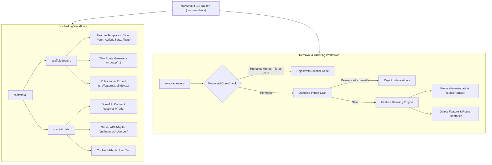

# Engineering Proposal: Feature Scaffolding and Removal in Frontendkit CLI

**Date:** 2026-10-03  
**Status:** Proposed — pending human design review  
**Scope:** CLI code generators and safe removal workflows in `tools/frontendkit/` and `src/features/`  
**Reference Implementation:** [`mobile-core-kit/packages/mobile_core_kit_cli`](file:///home/fikrilal/workspace/devs/core/mobile-core-kit/packages/mobile_core_kit_cli)

---

## Recommendation

Expand the canonical [`frontendkit`](file:///home/fikrilal/workspace/devs/core/frontend-core-kit/tools/frontendkit/cli.mjs) CLI with feature lifecycle workflows on par with `mobilekit`:

1. `frontendkit scaffold feature <name> [--slice <slice>] [--kind <authenticated|marketing>] [--dry-run]`: Generates a standard slice skeleton complying with Next.js App Router rules, pure shadcn UI primitives, co-located Server Actions, Zod validation, domain failures, unit tests, and a thin route entry point.
2. `frontendkit scaffold data --feature <name> --operation <id> [--dry-run] [--force]`: Reads OpenAPI specifications and scaffolds a typed server adapter and contract test adhering to the repository's `Result` pattern.
3. `frontendkit scaffold all --feature <name> --operation <id> [--slice <slice>] [--kind <authenticated|marketing>] [--dry-run]`: Chains architecture scaffolding and OpenAPI contract adapter generation.
4. `frontendkit remove feature <name> [--slice <slice>] [--dry-run] [--force-core] [--yes]`: Safely unwires routes, cleans public route metadata, removes feature directories, and enforces protected core guards (`auth`, `marketing`, `users`).

---

## Context

[`mobile-core-kit`](file:///home/fikrilal/workspace/devs/core/mobile-core-kit) already provides end-to-end scaffolding and surgical removal workflows (`scaffold feature`, `scaffold data`, `scaffold all`, `remove feature`). These tools eliminate repetitive boilerplate, guarantee architectural compliance from inception, and allow features to be cleanly excised without leaving dead references or breaking CI.

Currently, [`frontend-core-kit`](file:///home/fikrilal/workspace/devs/core/frontend-core-kit) only implements harness execution and lifecycle commands in [`tools/frontendkit/command.mjs`](file:///home/fikrilal/workspace/devs/core/frontend-core-kit/tools/frontendkit/command.mjs#L8-L21) (`doctor`, `verify`, `risk`, `knowledge`, `contracts`, `evidence`, `task`, `handoff`, `improve`). Feature generation in `src/features/` and route wiring in `src/app/` are entirely manual. Because the repository enforces strict architectural boundaries in [`scripts/harness/check-architecture.mjs`](file:///home/fikrilal/workspace/devs/core/frontend-core-kit/scripts/harness/check-architecture.mjs) (thin route files ≤50 lines, feature public export encapsulation, no deep cross-feature imports, pure shadcn tokens), manual creation is error-prone and slow.

Aligning `frontendkit` with `mobilekit` ensures both core starter kits provide identical developer ergonomics and mechanical consistency.

---

## Goals

- **Parity with Mobilekit**: Support `scaffold feature`, `scaffold data`, `scaffold all`, and `remove feature` subcommands.
- **Strict Architectural Fidelity**: Scaffolding must automatically pass [`check-architecture.mjs`](file:///home/fikrilal/workspace/devs/core/frontend-core-kit/scripts/harness/check-architecture.mjs), [`check-public-pages.mjs`](file:///home/fikrilal/workspace/devs/core/frontend-core-kit/scripts/harness/check-public-pages.mjs), ESLint rules, and TypeScript strict checks without requiring manual fixups.
- **Pure shadcn Defaults**: Generated UI primitives must use installed shadcn components (`@/components/ui/*`) and official tokens without custom inline style hacks.
- **Protected Core Safeguards**: Core features (`auth`, `marketing`, `users`) cannot be deleted without an explicit `--force-core` flag.
- **Safe Unwiring**: Feature removal must clean up route directories, public route manifests, and verify whether dangling imports exist before deletion.
- **Safe Preflights & Dry Run**: All commands must support `--dry-run` and collision checks to avoid accidental overwrites.
- **Structured Outputs**: Output adheres to `frontendkit`'s bounded `--json` contract and human-readable format.

---

## Non-Goals

- Replacing Next.js Server Components with a client-only single-page app framework.
- Hand-editing generated OpenAPI schemas; contracts remain generator-owned in `src/contracts/`.
- Adding bespoke CSS themes or third-party component libraries beyond the shadcn defaults.
- Automatically running git commits or mutating git history during scaffold or remove operations.

---

## Invariants and Constraints

1. **Thin Route Invariant**: Any generated route `src/app/**/page.tsx` must stay ≤50 lines, contain no raw JSX elements (e.g. `<div>`, `<form>`), call no direct `fetch()`, and only compose feature components exported from `@/features/<feature>`.
2. **Encapsulation Invariant**: Features must only be consumed via their public entry point `src/features/<feature>/index.ts`. No deep imports (e.g. `@/features/<feature>/<slice>/...`) across feature boundaries are permitted.
3. **Pure shadcn Invariant**: Generated forms and UI must compose installed primitives (`Button`, `Input`, `Label`, `Card`) with semantic tokens (`bg-background`, `text-foreground`, etc.).
4. **Collision Invariant**: `scaffold` commands must fail immediately if target files or directories already exist unless `--force` is provided.
5. **Protected Core Invariant**: `remove feature` must refuse deletion of `auth`, `marketing`, and `users` unless `--force-core` is passed.
6. **No Phantom State**: `remove feature` must prune public route references in [`src/app/site-metadata.ts`](file:///home/fikrilal/workspace/devs/core/frontend-core-kit/src/app/site-metadata.ts#L10-L15) when removing marketing pages, ensuring `pnpm public-pages:check` passes immediately.

---

## System Architecture



---

## Detailed Design

### 1. Feature Scaffolding: `frontendkit scaffold feature`

**CLI Syntax:**

```bash
pnpm frontendkit -- scaffold feature <feature-name> [options]
```

**Options:**

- `--slice <name>`: Slice name (kebab-case). Defaults to the feature name.
- `--kind <authenticated|marketing>`: Target route group. Default: `authenticated`.
- `--dry-run`: Previews files and directories without writing to disk.

**Generated Directory and File Structure:**

```text
src/
├── app/
│   └── (authenticated)/           # Or (marketing)/ based on --kind
│       └── <feature>/
│           └── page.tsx           # Thin route component (<= 15 lines)
└── features/
    └── <feature>/
        ├── index.ts               # Public barrel export
        └── <slice>/
            ├── <slice>-page.tsx   # Server Component composing UI
            ├── <slice>-form.tsx   # "use client" form with shadcn primitives
            ├── <slice>-action.ts  # Typed Server Action mutation handler
            ├── <slice>-state.ts   # Zod schema and ActionState definitions
            ├── <slice>-failure.ts # Domain error taxonomy
            ├── <slice>-action.test.ts  # Action unit tests
            └── <slice>-failure.test.ts # Failure mapping tests
```

#### Template Specifications

- **Route File (`src/app/(authenticated)/<feature>/page.tsx`)**:
  ```tsx
  import type { Metadata } from "next";
  import { ExamplePage } from "@/features/example";

  export const metadata: Metadata = {
    title: "Example",
  };

  export default function ExampleRoute() {
    return <ExamplePage />;
  }
  ```
- **Public API Export (`src/features/<feature>/index.ts`)**:
  ```ts
  export { ExamplePage } from "./example-slice/example-slice-page";
  ```
- **Client Form (`<slice>-form.tsx`)**: Composes `@/components/ui/button`, `@/components/ui/input`, `@/components/ui/label`, and `@/components/ui/card`.
- **Validation & State (`<slice>-state.ts`)**: Defines Zod validation schema and standard `ActionState<T>` return type.

---

### 2. Contract Data Scaffolding: `frontendkit scaffold data`

**CLI Syntax:**

```bash
pnpm frontendkit -- scaffold data --feature <feature-name> --operation <operationId> [options]
```

**Options:**

- `--openapi-spec <path>`: Path to OpenAPI spec. Defaults to `src/contracts/example-api/openapi.yaml`.
- `--force`: Overwrite existing adapter files.
- `--dry-run`: Previews code without writing to disk.

**Operation:**

1. Resolves `operationId` in the OpenAPI schema.
2. Extracts HTTP method, path, request parameters, request body schema, and 2xx/4xx response schemas.
3. Scaffolds `src/features/<feature>/server/<feature>-api.ts`:
   - Wraps the generated typed client from `@/contracts/example-api`.
   - Returns repository standard `Result<TData, TError>` from `src/server/api/result.ts`.
4. Scaffolds `src/features/<feature>/server/<feature>-api.test.ts` testing successful responses and problem details mapping.

---

### 3. End-to-End Scaffolding: `frontendkit scaffold all`

Chains `scaffold feature` and `scaffold data` sequentially:

1. Creates the feature architecture skeleton if it does not exist.
2. Scaffolds the OpenAPI server adapter and tests.
3. Links the server adapter into the slice's Server Action.

---

### 4. Feature Removal: `frontendkit remove feature`

**CLI Syntax:**

```bash
pnpm frontendkit -- remove feature <feature-name> [options]
```

**Options:**

- `--slice <name>`: Optional slice to remove instead of the whole feature.
- `--dry-run`: Previews removals and modifications without writing changes.
- `--force-core`: Required to delete protected core features (`auth`, `marketing`, `users`).
- `--yes`: Skips interactive confirmation in TTY mode.

**Removal & Unwiring Sequence:**

1. **Core Guard Preflight**:
   - Rejects removal if `<feature-name>` is in `['auth', 'marketing', 'users']` unless `--force-core` is supplied.
2. **Dangling Reference Inspection**:
   - Searches repository files outside `src/features/<feature>` for `@/features/<feature>` import specifiers.
   - If references are found, aborts with a list of referencing files to prevent compile breaks.
3. **Surgical Unwiring**:
   - **Public Routes ([`src/app/site-metadata.ts`](file:///home/fikrilal/workspace/devs/core/frontend-core-kit/src/app/site-metadata.ts#L10-L15))**: If the feature had a marketing page route, removes `{ path: "/<feature>", priority: ... }` from `publicRoutes`.
   - **Public Exports (`src/features/<feature>/index.ts`)**: If removing a single slice, removes that slice's re-exports.
4. **File Deletion**:
   - Deletes `src/features/<feature>/` (or specific slice folder).
   - Deletes `src/app/(authenticated)/<feature>/` or `src/app/(marketing)/<feature>/`.
   - Deletes associated test fixtures.

---

## Comparison Matrix: `mobilekit` vs `frontendkit`

| Capability              | `mobilekit` (Flutter)                   | `frontendkit` (Next.js)                          |
| :---------------------- | :-------------------------------------- | :----------------------------------------------- |
| **Command Router**      | `mobilekit scaffold ...`, `remove ...`  | `frontendkit scaffold ...`, `remove ...`         |
| **Component Model**     | Cubit / State / Page                    | Server Component + `"use client"` Form           |
| **State & Validation**  | Freezed DTO / Bloc State                | Zod Schema + `ActionState`                       |
| **Data Layer**          | Remote Datasource + Repository Impl     | Server Adapter (`server/*-api.ts`)               |
| **Route Registration**  | `app_router.dart` (GoRoute injection)   | Filesystem App Router (`src/app/(...)/page.tsx`) |
| **Public Manifest**     | Architecture lints exception            | `src/app/site-metadata.ts` (`publicRoutes`)      |
| **Public API Boundary** | `lib/features/<f>/di/<f>_module.dart`   | `src/features/<f>/index.ts`                      |
| **Protected Core**      | `auth`, `account`, `home`, `onboarding` | `auth`, `marketing`, `users`                     |
| **Dry Run Preview**     | Full directory and file preview         | Full directory and file preview                  |

---

## Implementation Phasing

1. **Phase 1: CLI Routing & Preflights**:
   - Extend [`command.mjs`](file:///home/fikrilal/workspace/devs/core/frontend-core-kit/tools/frontendkit/command.mjs) with `scaffold` and `remove` command schemas and parser options.
   - Implement snake_case / kebab-case string normalization and collision validators.
2. **Phase 2: Feature Scaffolding Engine**:
   - Create template engine for feature slices, thin route pages, Zod schemas, Server Actions, and unit tests.
   - Implement `frontendkit scaffold feature` with full `--dry-run` and collision detection.
3. **Phase 3: Data Scaffolding Engine**:
   - Create OpenAPI schema parser for `src/contracts/example-api/openapi.yaml`.
   - Implement `frontendkit scaffold data` and composite `scaffold all`.
4. **Phase 4: Feature Unwiring & Removal Engine**:
   - Implement import dependency scanner across `src/`.
   - Implement `site-metadata.ts` AST/regex modifier for `publicRoutes`.
   - Implement `frontendkit remove feature` with protected core guards.
5. **Phase 5: Verification & Regressions**:
   - Unit tests covering all parser, scaffold, and remove permutations.
   - End-to-end test verifying: `scaffold feature` → `pnpm verify` passes → `remove feature` → `pnpm verify` passes cleanly.

---

## Acceptance Criteria

1. **Scaffold Correctness**:
   - Running `pnpm frontendkit -- scaffold feature billing` generates a complete, valid slice that immediately passes `pnpm typecheck`, `pnpm lint`, `pnpm format:check`, and `pnpm architecture:check`.
   - Generated route file has ≤50 lines and contains no HTML/JSX tags.
2. **Data Scaffold Correctness**:
   - Running `pnpm frontendkit -- scaffold data --feature billing --operation billing.invoices.get` generates a typed server client adapter wrapping the contract schema and a passing unit test.
3. **Clean Removal & Unwiring**:
   - Running `pnpm frontendkit -- remove feature billing` deletes all billing directories, cleans `site-metadata.ts` if a marketing route was added, and leaves the repository in a passing verification state (`pnpm verify:fast`).
4. **Safety & Protection**:
   - Running `pnpm frontendkit -- remove feature auth` fails with an explicit blocker code (`core-feature-protected`) unless `--force-core` is specified.
   - Running `remove feature` on a feature imported by another active feature fails with a dependency error identifying the exact referencing file.
5. **Deterministic Preflight**:
   - `--dry-run` prints all intended additions/removals and makes zero filesystem mutations.
   - Running with `--json` outputs structured machine-readable result details without stdout pollution.

---

## Settled Decisions

1. **Default Route Group**: Defaults to `authenticated` (`src/app/(authenticated)/<feature>/page.tsx`). The optional `--kind <authenticated|marketing>` flag is available for flexibility. When `--kind marketing` is specified, the command will also wire the route into [`src/app/site-metadata.ts`](file:///home/fikrilal/workspace/devs/core/frontend-core-kit/src/app/site-metadata.ts#L10-L15) (`publicRoutes`) so `pnpm public-pages:check` passes immediately.
2. **Action Strategy**: Co-located Server Actions (`"use server"`) with Zod schema validation and standard `ActionState<T>` return type, adhering to Server Component patterns.

## Open Questions

None remaining. All architectural choices and invariants are settled.
