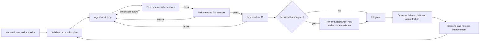

# Agent-First Harness And Loop Engineering Proposal

**Status:** Accepted on 2026-08-01

## Summary

Lamara Frontend should evolve from a repository with good local checks into a
risk-tiered, closed-loop engineering system designed for autonomous coding
agents.

The target is not unsupervised code generation. The target is to move human
attention to the decisions where it has the highest leverage:

- product intent and acceptance behavior;
- architecture and security decisions;
- visual and interaction judgment;
- authorization for destructive or externally visible actions.

Agents should own bounded implementation, focused tests, documentation updates,
mechanical repair, and evidence collection. Deterministic tooling should reject
known-bad structure and behavior before human review. Independent CI should
repeat the agent's checks. Repeated failures should improve the harness rather
than becoming permanent review folklore.

This proposal extends the existing
[engineering harness](../engineering/harness.md),
[testing strategy](../engineering/testing-strategy.md), and
[execution-plan workflow](../exec-plans/README.md). It does not authorize
implementation.

## Research Basis

The proposal combines four compatible ideas:

1. OpenAI's harness-engineering experience treats humans as intent setters and
   environment designers while agents execute. Repository-local knowledge,
   mechanical architecture rules, CI, and recurring cleanup make higher
   autonomy possible. `AGENTS.md` should be a concise map, not a monolithic
   manual.
2. Birgitta Bockeler's harness model separates feed-forward **guides** from
   feedback **sensors**, and deterministic **computational** controls from
   probabilistic **inferential** controls. It distinguishes maintainability,
   architecture-fitness, and behavioral harnesses.
3. LangChain's loop-engineering model wraps the basic agent loop in a
   verification loop, an event-driven integration loop, and a hill-climbing
   loop that improves the harness from observed traces and failures.
4. Robert C. Martin's recent public discussion moves review from every line of
   agent-written implementation toward strict mechanical constraints,
   acceptance tests, QA procedures, and criticality-weighted human checks. His
   accompanying warning is equally important: messy code slows agents down, but
   stacking every possible test type on every task is also wasteful.

Primary references:

- [Harness engineering: leveraging Codex in an agent-first world](https://openai.com/index/harness-engineering/)
- [Harness engineering for coding agent users](https://martinfowler.com/articles/harness-engineering.html)
- [The Art of Loop Engineering](https://www.langchain.com/blog/the-art-of-loop-engineering)
- [Robert C. Martin's likely original X post](https://x.com/unclebobmartin/status/2080257779395154409)

X did not expose the post text to the research tooling. The proposal therefore
uses the attributed ideas as supporting context, not as an independently
verified normative source. A useful secondary reconstruction is
[Uncle Bob Doesn't Review AI Code. He Builds a Gauntlet Instead](https://www.explainx.ai/blog/uncle-bob-ai-coding-gauntlet-tests-not-reviews-july-2026).

## Current State And Observed Failure Modes

The repository already has a meaningful foundation:

- `AGENTS.md` maps source-of-truth documents and records non-negotiable
  boundaries;
- `pnpm verify:fast`, `pnpm verify`, and `pnpm verify:runtime` provide layered
  verification;
- strict TypeScript, ESLint, Prettier, Vitest, Playwright, generated OpenAPI
  contracts, and runtime Zod validation provide deterministic sensors;
- `scripts/harness/check-architecture.mjs` checks environment access, raw
  `fetch`, Client/Server separation, feature imports, and thin routes;
- `scripts/harness/check-public-pages.mjs` reconciles implemented public routes
  and metadata;
- execution plans record decisions, evidence, and completed work.

The recent repository history also exposes the limits of the current system:

- copied product assumptions survived in code, tests, and documentation until
  a deliberate cleanup;
- Redis was implemented from an assumed multi-instance topology before the
  actual single-instance constraint was confirmed;
- the minimal execution-plan template is much weaker than the completed plans
  that were needed in practice;
- `AGENTS.md` says server-only integration belongs under `src/server/**`, while
  the accepted pattern puts feature-owned endpoint adapters under
  `src/features/<feature>/server/**`;
- browser tests use a deterministic API fixture but did not expose an
  uninitialized real backend database;
- a safe generic login message correctly hid backend detail, but there was no
  frontend development preflight that immediately identified backend
  readiness as the failing boundary;
- no independent CI currently enforces the documented local gates;
- maintainability constraints cover route length but not function complexity,
  duplication, dead exports, or broader file growth;
- visual direction depends on instructions and local reference repositories,
  without repository-owned screenshot evidence.

These are harness gaps, not reasons to add more prose to the agent prompt.

## Goals

- Make the intended product behavior and architecture legible from versioned,
  repository-local artifacts.
- Let an authorized agent take a bounded task from diagnosis through a verified
  pull request with minimal supervision.
- Detect known structural, behavioral, security, documentation, and visual
  regressions mechanically.
- Make feedback actionable enough that an agent can repair failures without
  guessing.
- Keep every committed state reproducible and independently verified.
- Preserve clean, simple code through calibrated constraints and ratchets,
  without imposing speculative architecture layers.
- Improve the harness from repeated failures and escaped defects.
- Scale verification cost and human involvement with risk.

## Non-Goals

- Autonomous product discovery or invention of wedding-organizer workflows.
- Autonomous production deployment, database mutation, secret rotation,
  billing, or other destructive external actions.
- Eliminating human judgment from security, architecture, acceptance behavior,
  or visual quality.
- Treating an LLM reviewer as a deterministic correctness oracle.
- Requiring Gherkin, mutation testing, full browser coverage, or the most
  expensive suite for every change.
- Introducing Clean Architecture folders, repositories, use cases, or global
  state where current behavior does not need them.
- Extracting a reusable frontend core kit before a second product proves real
  shared requirements.

## Operating Principles

### Humans own intent; agents own execution

A human-approved product specification or execution plan defines the observable
outcome, exclusions, risk, and authority. The agent may improve implementation
tests, but it must not weaken or reinterpret the acceptance contract merely to
make the suite pass.

### Deterministic controls are authoritative

Types, schema validation, linters, structural rules, tests, builds, contract
checks, and browser assertions are the primary sensors. Inferential review can
find semantic duplication, overengineering, or missing cases, but its result is
advisory until converted into an accepted decision or deterministic control.

### Constraints reduce variety at stable boundaries

The harness should strongly constrain boundaries, correctness, security, and
reproducibility while allowing local implementation freedom. A new endpoint
should follow one recognized topology; it should not trigger a new architecture
framework.

### Quality is left-shifted and risk-tiered

Fast checks run during the agent's repair loop. Full builds, runtime tests, and
specialized security or integration evidence run when affected paths and the
declared risk require them. Expensive controls must earn their cost.

### Repeated failures change the system

When the same failure, review comment, or diagnostic gap occurs twice, the
default response is a harness improvement: a clearer guide, a scaffold, a
test, a structural rule, or better diagnostic output. The existing two-strike
rule becomes a tracked engineering loop rather than an informal reminder.

## Proposed Closed-Loop System



The loops have distinct responsibilities:

1. **Intent loop:** establish product behavior, non-goals, risk, and authority.
2. **Agent loop:** inspect, implement a small change, and keep the plan current.
3. **Verification loop:** run sensors, consume actionable feedback, and repair
   within a bounded attempt budget.
4. **Integration loop:** reproduce results from a clean checkout in CI and
   collect independent evidence.
5. **Steering loop:** analyze escaped defects, repeated repairs, stale docs,
   and review feedback; then improve the guides or sensors.

The system must stop and escalate when intent is ambiguous, a required external
system is unavailable, the repair budget is exhausted, or an action exceeds
the plan's authority.

## Change Contract And Execution Plans

Every non-trivial autonomous change should have a machine-checkable execution
plan. The plan is the contract between human intent and agent execution, not a
progress essay.

The strengthened plan format should require:

| Field                       | Purpose                                                                        |
| --------------------------- | ------------------------------------------------------------------------------ |
| Objective and user outcome  | Defines observable success rather than a code task                             |
| Current evidence            | Prevents implementation from starting from assumptions                         |
| Decisions and invariants    | Records settled product, architecture, and security choices                    |
| Non-goals                   | Prevents speculative routes, abstractions, and dependencies                    |
| Acceptance scenarios        | Provides an implementation-independent behavioral oracle                       |
| Risk class                  | Selects minimum controls and human gates                                       |
| Impact and trust boundaries | Raises hidden auth, secret, API, or persistence risk                           |
| Authority                   | States whether the agent may edit, commit, open a PR, or affect external state |
| Verification matrix         | Maps each acceptance condition to its required evidence                        |
| Rollout and rollback        | Defines recovery before implementation                                         |
| Decision and deviation log  | Makes approved changes to intent explicit                                      |

A plan validator should check structure, links, status, unique ownership, and
required fields. It cannot judge whether the product decision is good.

Risk is the maximum of the human-declared risk and path-derived risk. Automation
may raise risk but must never lower it. Touching auth, sessions, API contracts,
secrets, deployment, or persistence should mechanically select a high-risk
minimum even if a plan declares less.

Acceptance scenarios should be approved before implementation for medium- and
high-risk behavior. An agent may add lower-level tests, but changing an approved
scenario requires a recorded decision rather than a silent test rewrite.

## Guide And Sensor Matrix

The harness should regulate different qualities explicitly instead of treating
`pnpm verify` as one undifferentiated signal.

| Dimension        | Feed-forward guides                                            | Deterministic sensors                                                            | Judgment layer                                                             |
| ---------------- | -------------------------------------------------------------- | -------------------------------------------------------------------------------- | -------------------------------------------------------------------------- |
| Maintainability  | Naming, locality, simplicity, accepted feature topology        | Type/lint checks, complexity and size ratchets, duplication and dead-code checks | Periodic semantic simplification review                                    |
| Architecture     | `architecture.md`, ownership rules, feature/API patterns       | AST/dependency rules, route and Client/Server checks, forbidden imports          | Human approval for new boundaries or dependencies                          |
| Behavior         | Product spec, acceptance scenarios, API contract               | Unit, contract, integration, Playwright, approved fixtures                       | Human reviews acceptance meaning and critical UX                           |
| Security/privacy | Trust-boundary and secret-handling rules                       | Secret scan, dependency audit, credential-leakage tests, safe-log checks         | Mandatory review for auth, authorization, destructive actions, and privacy |
| Delivery         | Environment and evidence policy                                | Clean install, build, CI, container/runtime smoke, rollback checks               | Human approves release/deployment policy                                   |
| Knowledge        | Source-of-truth map and document ownership                     | Link, path, status, freshness, and implemented/planned consistency checks        | Periodic documentation gardening                                           |
| UI quality       | Design system, repository-owned references, interaction states | Accessibility checks, responsive runtime cases, screenshot diff                  | Human visual/taste review proportional to change                           |

### Clean-code constraints

Clean code remains important because future agents are the primary readers and
modifiers. The enforcement strategy should be calibrated rather than dogmatic:

- measure the current baseline before selecting thresholds;
- start with no-regression ratchets for function size, complexity, duplication,
  and dead exports;
- keep thresholds local to the topology when one global number would be
  misleading;
- require explicit, narrow exceptions with reasons and ownership;
- prefer existing TypeScript/ESLint capabilities before custom parsers;
- use custom structural checks only for repository-specific architecture;
- measure test quality at important boundaries, not by pursuing 100% line
  coverage;
- add mutation testing selectively only after it proves value for critical pure
  logic or acceptance oracles.

The goal is to prevent tangles and make repairs cheap, not to optimize vanity
metrics.

## Risk And Autonomy Policy

| Risk       | Typical examples                                                             | Required loop                                                               | Maximum default autonomy                                  |
| ---------- | ---------------------------------------------------------------------------- | --------------------------------------------------------------------------- | --------------------------------------------------------- |
| Low        | Narrow docs, formatting, mechanical generated updates                        | Fast sensors and CI                                                         | Implement, commit, and open PR when explicitly authorized |
| Medium     | Additive endpoint, public UI, non-sensitive route behavior                   | Plan, fast/full sensors, runtime evidence, CI                               | End-to-end PR; human validates acceptance/visual outcome  |
| High       | Auth/session, contracts, security/privacy, deployment, persistence           | Approved plan and acceptance contract, specialized evidence, CI, human gate | Implement and repair; no merge without human approval     |
| Restricted | Production data, secrets, billing, destructive migration, external messaging | Explicit live approval and operational runbook                              | No autonomous external mutation                           |

Authority must be explicit per task. A plan does not imply permission to commit,
push, merge, deploy, alter production data, or contact external users.

Auto-merge should be deferred until independent CI is stable, required checks
are non-flaky, rollback is proven, and low-risk agent PRs have an evidence base.
It should never be the initial milestone.

## Verification And Evidence

### Local repair loop

The local loop should expose one entry point that:

1. validates environment and repository prerequisites;
2. determines the minimum risk from changed paths and the active plan;
3. runs the cheapest relevant sensors first;
4. emits concise failures with the violated invariant and remediation path;
5. escalates to build, runtime, security, or integration lanes as required;
6. produces a machine-readable summary without committing raw logs.

The repair loop must be bounded. Repeatedly running the same failing command
without new evidence is not progress.

### Independent CI

CI should run from a clean checkout with the pinned Node and pnpm versions. It
should independently repeat required gates and publish a compact evidence
summary. Local claims are useful feedback but are not integration proof.

Suggested lanes are conceptual rather than a fixed job layout:

- knowledge and plan validation;
- formatting, contracts, lint, types, unit tests, and architecture fitness;
- production build;
- browser behavior and visual evidence;
- security/dependency checks;
- real-integration or container smoke where the task requires it.

The path/risk classifier chooses the minimum lanes. CI may add lanes and cannot
accept a weaker selection from the agent.

### Behavioral independence

Agent-written unit tests are not sufficient proof when the same agent chose the
implementation and oracle. Important behavior needs at least one independent
source:

- a human-approved acceptance scenario;
- a generated external contract;
- an approved fixture;
- an existing regression test written before the change;
- or runtime evidence against a separately owned system.

For Lamara API work, the generated OpenAPI contract remains the compile-time and
runtime boundary. The browser fixture should be validated against that contract,
and a separate real-backend readiness/smoke lane should exist for changes whose
success depends on backend runtime state.

### Diagnostics and secret safety

Development diagnostics should identify the failing boundary while production
UI remains safe. The harness should provide sanitized preflight commands for
environment presence, frontend configuration, backend readiness, and contract
compatibility.

Agents and scripts must not print entire `.env` files, credentials, cookies,
authorization headers, request bodies, or raw sensitive responses. Secret files
should be treated as inaccessible inputs; tooling should report missing names
and readiness states without revealing values.

## Knowledge Architecture

`AGENTS.md` should remain a short entry point and source-of-truth map. Durable
knowledge belongs in focused documents close to the code and is checked for
links, ownership, status, and freshness.

The first knowledge correction should resolve the server-adapter ambiguity:

```text
src/server/**
  Shared server infrastructure: transport, session, configuration.

src/features/<feature>/server/**
  Feature-owned server adapters and endpoint policy.
```

Repository-local visual references should replace absolute-machine-only
knowledge where licensing and size permit. If the original codebases remain the
source, the repository should store durable screenshots, measurements, or
component records that CI and remote agents can access.

Documentation checks should verify at least:

- every indexed path exists;
- proposal, current-state, and execution-plan statuses are consistent;
- active plans are unique and complete;
- implemented versus planned claims match discoverable routes and modules where
  that relationship is mechanically knowable;
- superseded documents point to their replacement;
- completed plans contain evidence and no unresolved required checkbox.

## Steering And Hill-Climbing Loop

The harness should maintain a small, versioned feedback ledger for:

- escaped defects;
- repeated agent repair attempts;
- recurring review comments;
- flaky or misleading sensors;
- stale documentation;
- unnecessary dependencies or abstractions;
- missing diagnostics;
- human interventions and their reason.

The steering loop should periodically classify entries:

1. one-off mistake: fix the task;
2. unclear intent: improve the product spec or plan template;
3. missing knowledge: improve a source-of-truth document or scaffold;
4. mechanically detectable violation: add or strengthen a sensor;
5. poor diagnostic: make the failure actionable and secret-safe;
6. false positive or excess cost: simplify or retune the harness.

Recurring gardening may be agent-assisted, but harness changes require the same
review and CI as product changes. An agent must not silently rewrite its own
grader or lower a threshold to pass.

Useful operating metrics are:

- first-pass and eventual gate pass rates;
- repair attempts per change;
- escaped defects by risk class;
- flaky-check rate;
- time to identify the failing boundary;
- human intervention rate and reason;
- stale-document findings;
- harness false-positive rate;
- change lead time and rollback frequency.

Coverage percentage, lines of code, and number of agent commits are not success
metrics by themselves.

## Proposed Delivery Phases

### Phase 1: Make intent and knowledge executable

Strengthen the plan contract, resolve contradictory ownership guidance, add
knowledge/link/status checks, define risk/authority metadata, and record the
current quality baseline.

### Phase 2: Establish independent integration proof

Add GitHub CI for clean installation and current gates, introduce deterministic
path/risk classification, publish evidence summaries, and make required checks
branch-protection ready.

### Phase 3: Expand fitness and behavioral sensors

Add maintainability ratchets, stronger AST/dependency checks, approved
acceptance fixtures, backend preflight/smoke capability, accessibility checks,
and repository-owned visual evidence. Add each sensor only with a demonstrated
failure mode and acceptable signal-to-noise ratio.

### Phase 4: Close the autonomous repair loop

Provide one task-oriented verification entry point with actionable output,
bounded repair behavior, clean-worktree/diff-scope checks, and explicit
escalation conditions. Enable agents to open and repair PRs within per-task
authority.

### Phase 5: Add controlled hill climbing

Track harness feedback, schedule documentation and quality gardening, measure
agent friction and escaped defects, and propose narrow harness improvements.
Consider low-risk auto-merge only after sustained evidence supports it.

Each phase requires its own execution plan. Later phases must not be implemented
speculatively before the earlier feedback loop exists.

## Alternatives Considered

### Add more rules to `AGENTS.md`

Rejected as the primary strategy. Large manuals become stale, consume context,
and remain unenforced. `AGENTS.md` should route agents to executable knowledge.

### Trust agent-written tests because the suite is green

Rejected. The agent can misunderstand the behavior consistently in both code
and tests. Acceptance needs an independent oracle for material behavior.

### Use an LLM reviewer on every change

Rejected as an authoritative gate. Inferential review is useful for semantic
issues but is slower, probabilistic, and unable to repair an ambiguous product
specification.

### Run every expensive test on every edit

Rejected. It increases cost and latency without proportional confidence. Fast
left-shifted sensors and risk-selected deeper lanes provide a better loop.

### Apply full Clean Architecture everywhere

Rejected. Harnessability comes from clear current boundaries and constrained
topologies, not maximum layer count. New layers require demonstrated complexity
or reuse.

### Immediately allow autonomous merge and deployment

Rejected. The repository first needs independent CI, stable sensors, explicit
authority, rollback proof, and operating evidence.

## Risks And Tradeoffs

- More sensors can create slow, noisy loops. Every new gate needs an owner,
  measured cost, and a retirement path.
- Structural metrics can reward superficial decomposition. Thresholds should be
  ratchets and investigation signals, not universal design laws.
- Browser screenshots can be flaky across environments. Fonts, viewport,
  animation, and rendering must be controlled before blocking merges.
- Real-backend integration can become slow and stateful. It should use isolated,
  reproducible infrastructure and remain separate from deterministic fixture
  tests.
- Acceptance artifacts can also be wrong. Human review moves up to intent and
  scenarios; it does not disappear.
- A self-improving harness can weaken itself. Changes to graders, thresholds,
  risk classification, and authority policy require independent review.
- Optimizing only for agents can harm human maintainability. Repository
  legibility must serve both future agents and human owners.

## Acceptance Conditions

This proposal is successfully implemented when:

- a non-trivial task cannot start without a valid plan containing risk,
  authority, non-goals, and acceptance evidence;
- a deterministic classifier can raise the required verification lanes from
  changed paths;
- one local command gives an agent an actionable, risk-appropriate repair loop;
- CI independently reproduces every required gate from a clean checkout;
- medium- and high-risk behavior has an independent acceptance oracle;
- high-risk and restricted actions stop at explicit human gates;
- architecture, maintainability, knowledge, security, behavior, delivery, and
  UI controls have named owners and documented failure messages;
- backend-dependent work can distinguish configuration, readiness, contract,
  authentication, and application failures without leaking secrets;
- repeated failures are recorded and result in measurable harness changes;
- harness cost, flakiness, false positives, repair attempts, and escaped defects
  are observable;
- the system supports agent-driven verified pull requests while preserving the
  single-instance session constraint and current product non-goals.

## Open Questions And Recommended Defaults

1. **CI provider:** use GitHub Actions because the repository already follows a
   Git-oriented PR workflow and has GitHub-compatible commit conventions.
2. **Initial autonomy:** allow authorized agents to implement, commit, open PRs,
   and repair CI; retain human merge approval until evidence supports a narrower
   low-risk exception.
3. **Acceptance format:** use structured Markdown scenarios plus executable
   Vitest/Playwright tests. Do not add Cucumber/Gherkin unless non-engineering
   stakeholders actually benefit from it.
4. **Maintainability thresholds:** measure the repository first and introduce
   no-regression ratchets. Do not choose arbitrary global limits in advance.
5. **Visual source:** capture repository-owned baselines from the pinned local
   references before relying on remote agents or CI.
6. **Backend integration:** begin with a sanitized readiness preflight and
   contract-validated fixtures; add an isolated real-backend CI lane when the
   backend has a reproducible cross-repository startup contract.
7. **Inferential review:** keep it advisory in the first implementation. Promote
   a finding to a blocking rule only after humans accept the invariant and it
   can be enforced with acceptable reliability.
